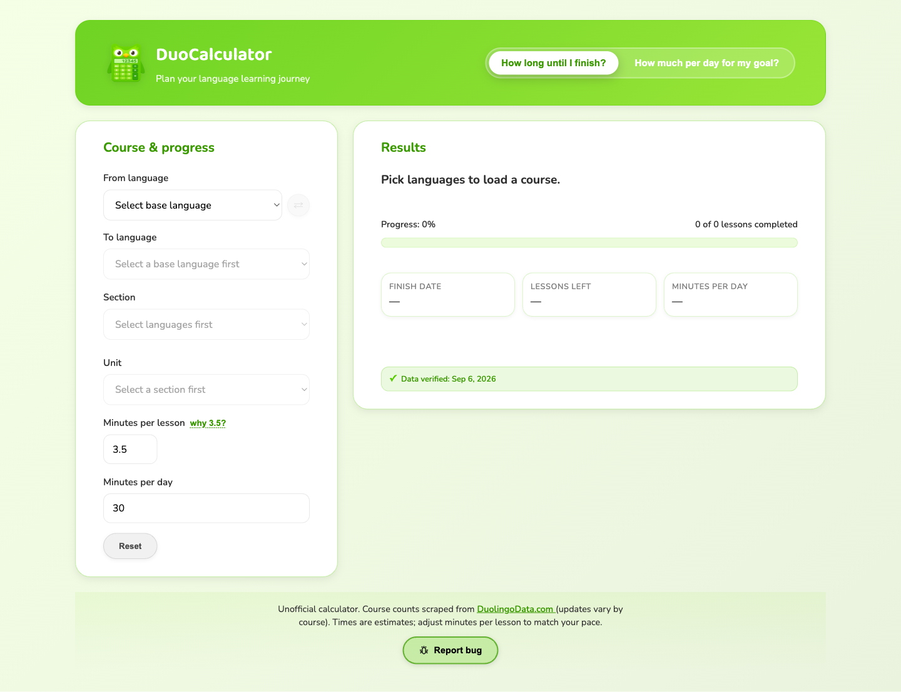

# DuoCalculator

[DuoCalculator](https://www.duocalculator.com) is a small project for estimating how long it will take to finish a Duolingo course. It can also work backward from a target date to estimate how much practice would be needed each day.

<p align="center">
  <a href="https://www.duocalculator.com">
    
  </a>
</p>

## Project overview

- Choose a course and current section or unit
- Estimate a finish date based on daily practice time
- Set a target date and calculate the required daily pace
- Adjust the assumed time per lesson

## Course data

Course structure comes from [DuolingoData.com](https://duolingodata.com/) and currently covers more than 300 courses. A weekly job refreshes the data and checks the course index and detail files before replacing the existing dataset.

Duolingo changes its courses regularly, and lesson length varies from person to person, so the results are only estimates. The site shows when its course data was last checked.

## Development

Use Node.js 18.17 or newer.

```bash
npm install
npm run dev
```

The scraper has its own dependencies and tests:

```bash
cd scripts/scraper
npm ci
npm test
npm run validate
```

DuoCalculator is not affiliated with or endorsed by Duolingo.
